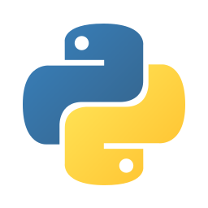

# TechGeeks-Club-Website

Welcome to the showcase repository for the TechGeeks Club Website!
## Table of Contents

- [Overview](#Overview)
- [Project Description](#project-description)
- [Technologies Used](#technologies-used)
- [Screenshots](#screenshots)
<!-- - [Acknowledgements](#acknowledgements) -->

## Overview

This repository serves as a showcase for the TechGeeks Club ( gulema university computer science club ) Website project. Unfortunately, the source code is not available as it is a private project. However, this README.md provides a comprehensive overview of the project's purpose, features, and technologies used.

**Note :**  The website will be launched soon.

## Project Description
This project represents the TechGeeks Club Website ,This project is a customized web application designed for easy management and presenting the club effectively.

## Technologies Used
List the technologies and tools that were used in the development of the project. This could include programming languages, frameworks, databases, and any other relevant technologies.

## Screenshots (comming soon)
<!-- ## Acknowledgements -->
